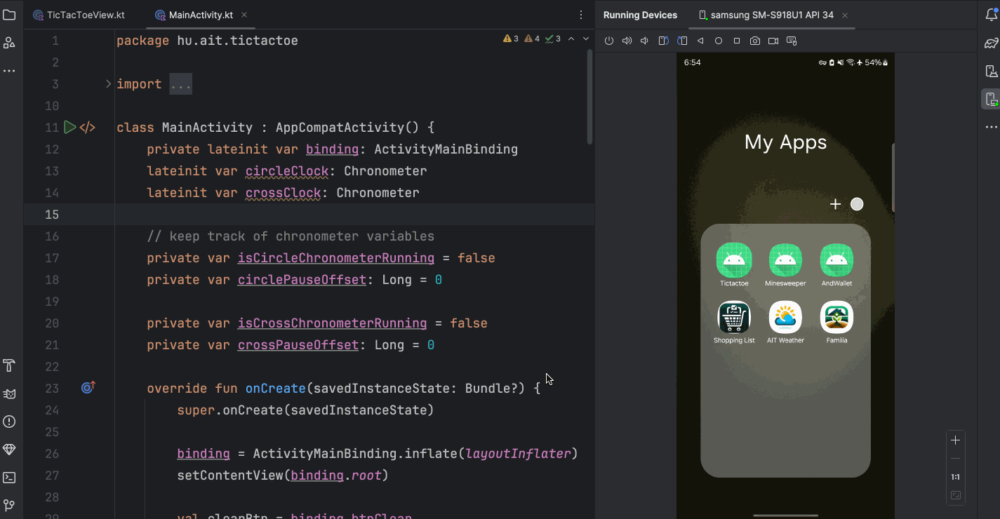

# TicTacToe

TicTacToe is a classic game built using Kotlin and custom layouts. The game board is drawn using Canvas to provide a dynamic and interactive experience.



## Features

- **Two-Player Mode**: Play against a friend on the same device.
- **Chronometer**: Built-in timers to track the time taken by each player.
- **Pause and Restart**: Pause the game anytime and restart a new game with a single click.
- **Dynamic Board Drawing**: The game board is dynamically drawn using Canvas for a smooth gaming experience.
- **Interactive UI**: Clean and intuitive user interface for an enjoyable gameplay experience.

## Installation

1. Clone the repository:
    ```sh
    https://github.com/leemabhena/android-tictactoe.git
    ```
2. Open the project in Android Studio.
3. Build the project and run it on an emulator or a physical device.

## Usage

1. Launch the TicTacToe app.
2. Press "New Game" to start the game.
3. Take turns to place your mark (X or O) on the grid.
4. The game automatically checks for a winner or a draw after each move.
5. Use the "Pause" button to pause the game and the "Restart" button to start a new game.

## Technical Details

- **Built with Kotlin**: Utilizes Kotlin for concise and expressive code.
- **Custom Layouts**: Uses custom XML layouts for a responsive UI.
- **Canvas Drawing**: Implements Canvas for dynamic drawing of the game board, ensuring smooth and interactive graphics.
